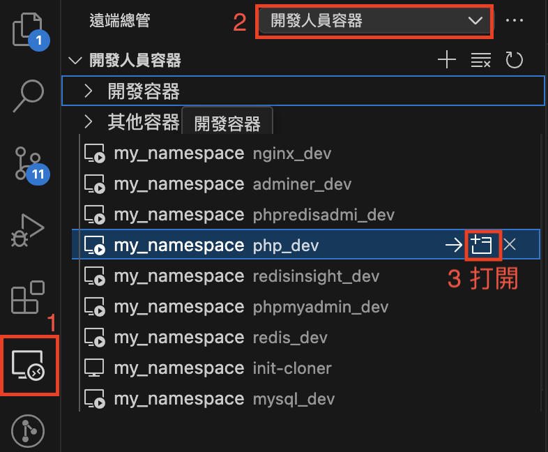

# 本地開發範本 Docker Compose ＋ Remote SSH/Dev Container
使用 Docker Compose 與 Remote SSH/Dev Container 建立本地開發範本，供需要的人參考引用。

## 環境支援
- Nginx
- PHP
  - Web root: /srv/app
- MySQL
  - mysql.localtest.me:3306
    - user: root
    - password: dev
  - [Adminer](http://adminer.localtest.me)
  - [phpMyAdmin](http://phpmyadmin.localtest.me)
- Redis
  - redis.localtest.me:6379
  - [RedisInsight](http://redisinsight.localtest.me)
  - [phpRedisAdmin](http://phpredisadmin.localtest.me)

## 調整環境
- docker/nginx/nginx.conf
  - server_name
  - root
  - fastcgi_pass
- .env

## 手動啟動 Docker Compose
```sh
# 啟動 Docker Compose - 使用 docker-compose.yaml 
$ docker-compose up -d --build
```
> `-d`: 背景服務模式
> `--build`: 強制重建容器(如果需要build)


## 手動關閉 Docker Compose
```sh
$ docker-compose down
```

## 匯入DB資料
```bash
docker exec -i mysql_dev mysql -u root -pdev < ~/database/mydb.sql
```

## 拉取程式
因MacOS映射Volume有IO延遲問題，經 VirtioFS 優化後，IO速度接近 Linux/Windows 的 60%/70%，但速度還是較慢，建議在容器內拉取程式

- .env
  - 初始化程式碼 init_cloner
- docker-compose.yaml
  - 初始化程式碼 init_cloner
> - 也可以進入容器中手動拉取


## 連線至開發環境
### 使用 Remote SSH 連線 「開發人員容器」(建議)
1. 進入「連線總管」
2. 上方群組選擇「開發人員容器」
3. 打開目標容器


### 使用 Dev Container 的「在容器中重新開啟」
- 安裝容器開發插件 Dev Container
  - `Visual Studio Code`安裝插件`Dev Containers`
- 設定 .devcontainer/devcontainer.json
- 按左下角 or 快速鍵：
  - 在容器中重新開啟： `control` + `command` + `c`
  - 在區域重新開啟資料夾： `control` + `command` + `l`
  - 在容器中重建而不使用快取，然後重新開啟: `需自定快速鍵`

## 參考資料
- [Docker Images](https://github.com/marshung24/docker-images)
- [Docker LNMP](https://github.com/marshung24/Docker-LNMP-Mars)
- [Remote SSH](https://code.visualstudio.com/docs/remote/ssh)
- [VSCode DevContainer](https://code.visualstudio.com/docs/devcontainers/containers)


